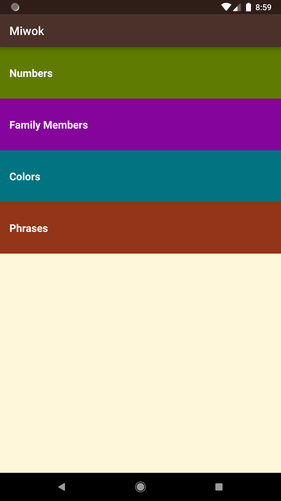
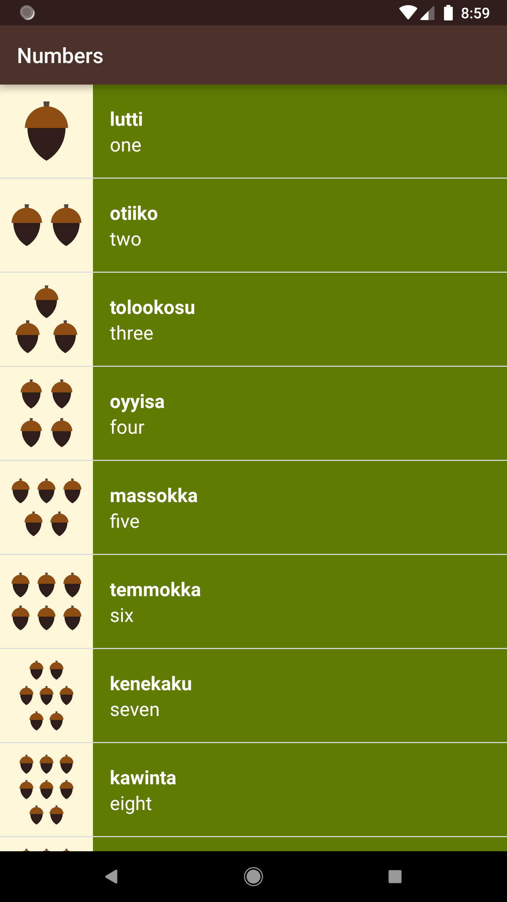
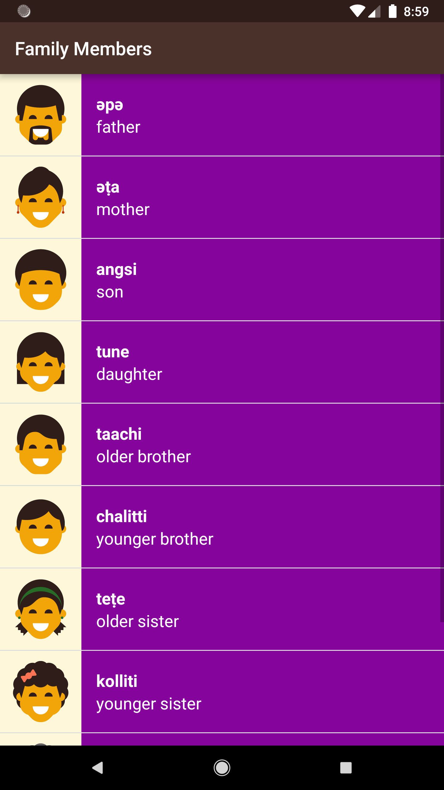
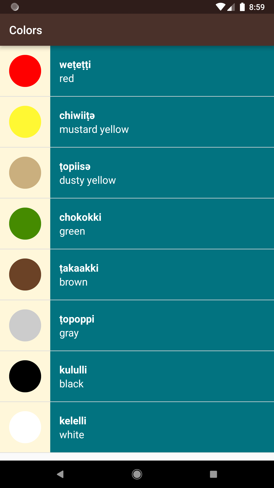
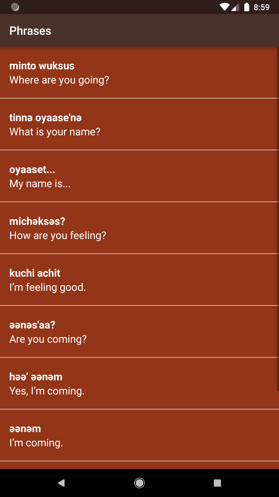

Miwok App
===================================

This app displays lists of vocabulary words for the user to learn the Miwok language.
Made under Udacity's Android Basics: Multi-screen Apps course (Android Basics Nanodegree).

**Features**
====================================

1. Plays the pronunciation(_Audio_) of the displayed words to help the user learn the correct pronunciation of the language.
2. Follows Material design guidelines for a high-quality digital experience.
3. Uses Custom ArrayAdapter with listView.

<h3> Screens:<h3/>

&nbsp;
&nbsp;
&nbsp;
&nbsp;
&nbsp;

Pre-requisites
--------------

- Android SDK v23
- Android Build Tools v23.0.2
- Android Support Repository v23.3.0

License
-------

Copyright 2016 The Android Open Source Project, Inc.

Licensed to the Apache Software Foundation (ASF) under one or more contributor
license agreements.  See the NOTICE file distributed with this work for
additional information regarding copyright ownership.  The ASF licenses this
file to you under the Apache License, Version 2.0 (the "License"); you may not
use this file except in compliance with the License.  You may obtain a copy of
the License at

http://www.apache.org/licenses/LICENSE-2.0

Unless required by applicable law or agreed to in writing, software
distributed under the License is distributed on an "AS IS" BASIS, WITHOUT
WARRANTIES OR CONDITIONS OF ANY KIND, either express or implied.  See the
License for the specific language governing permissions and limitations under
the License.
